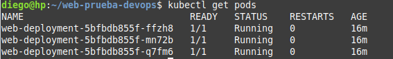
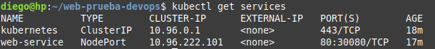
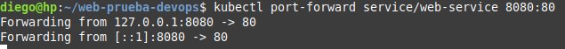
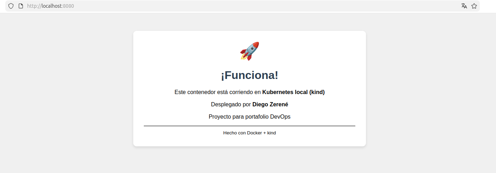

# 🚀 Proyecto: Despliegue en Kubernetes local con kind

## 📋 Descripción

Despliegue de una aplicación web en un clúster de Kubernetes local usando **kind** (Kubernetes in Docker).

## 🛠️ Tecnologías usadas

- **Docker**: Contenerización de la aplicación
- **kind**: Clúster Kubernetes local
- **kubectl**: Gestión del clúster
- **Linux Mint**: Sistema operativo
- **nginx**: Servidor web

## 📸 Resultados

### Pods corriendo (3 réplicas)


### Servicio NodePort expuesto


### Port-forward activo


### Aplicación funcionando en el navegador


## 🧪 Cómo reproducirlo

```bash
# 1. Crear clúster kind
kind create cluster --name devops-cluster

# 2. Construir imagen Docker
docker build -t mi-web:v1 .

# 3. Cargar imagen al clúster
kind load docker-image mi-web:v1 --name devops-cluster

# 4. Desplegar en Kubernetes
kubectl apply -f deploy.yaml

# 5. Exponer el servicio
kubectl port-forward service/web-service 8080:80

#🧹 Limpieza (opcional)

Cuando termines, destruye el clúster para liberar recursos:
bash

kind delete cluster --name devops-cluster
 
